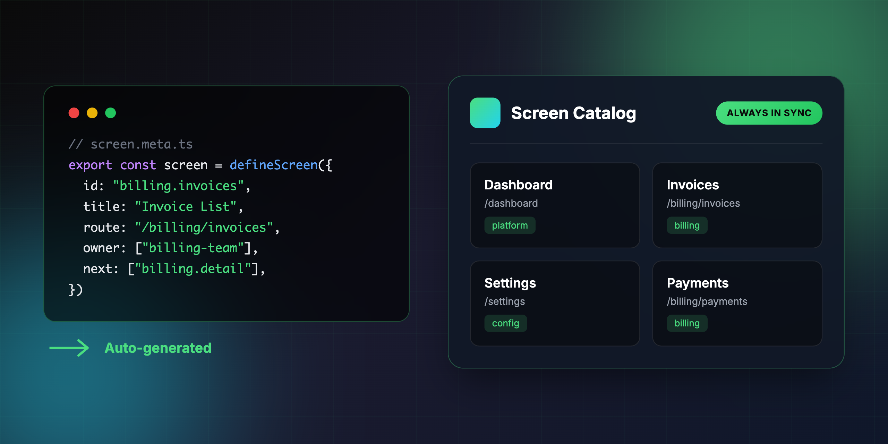
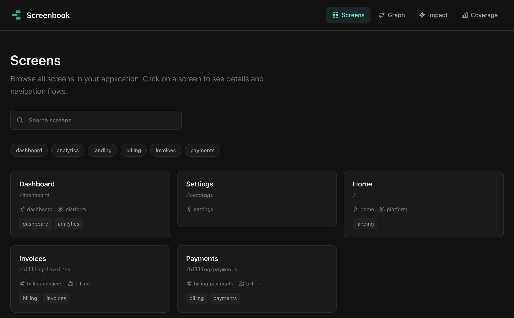
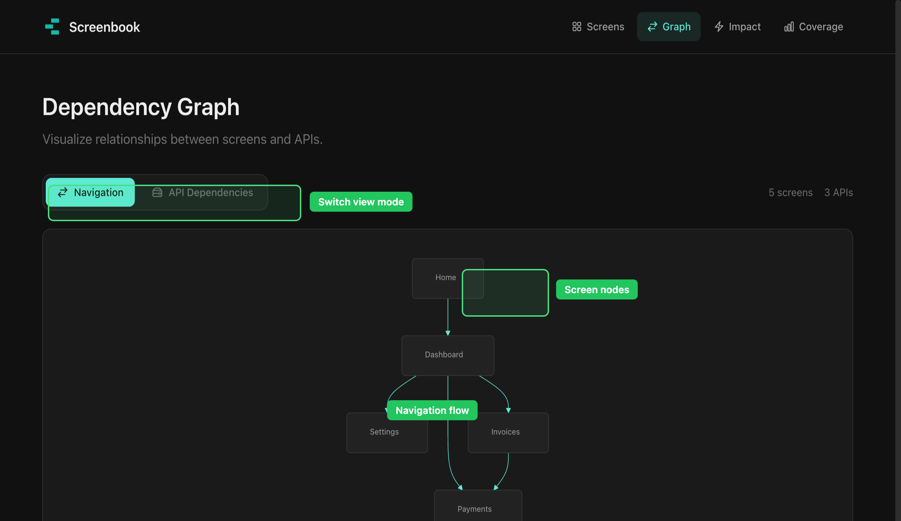
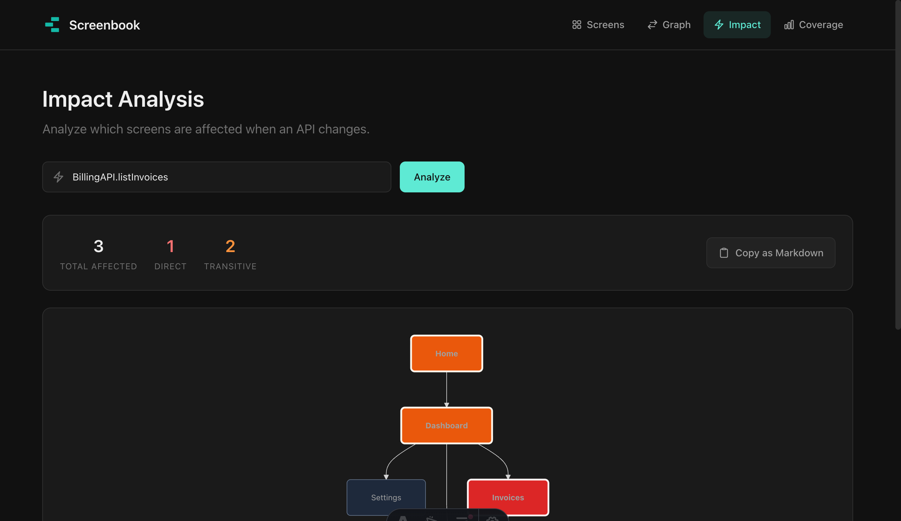
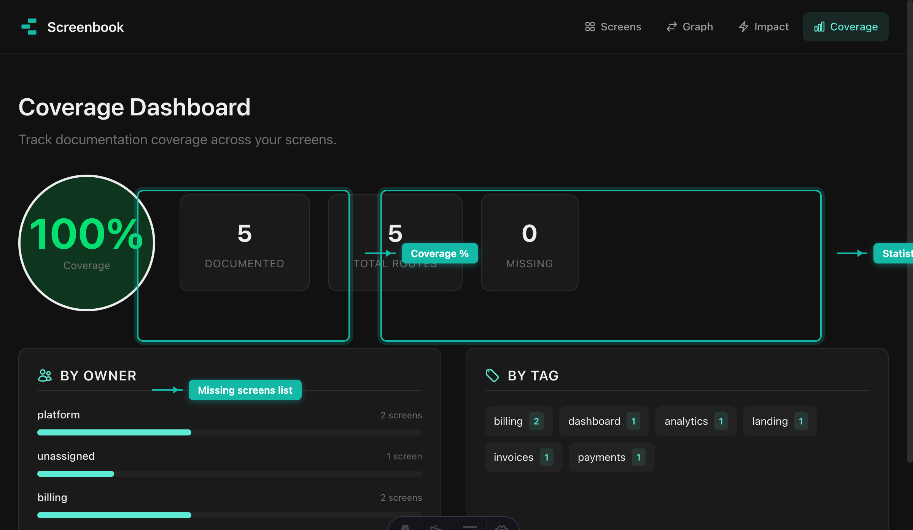

<h1 align="center">
  
</h1>

<p align="center">
  <strong>Define screens in code. Get an always-up-to-date catalog.</strong>
</p>

<p align="center">
  <a href="#quick-start">Quick Start</a> •
  <a href="#features">Features</a> •
  <a href="#why-screenbook">Why Screenbook?</a> •
  <a href="#cli-commands">CLI</a>
</p>

---

## The Problem

Every team has a screen map somewhere — FigJam, Figma, Notion, or buried in a wiki.

**When was yours last updated?**

Sound familiar?

- "Where's the screen map?" → "Check Notion... or maybe the old Figma file?"
- "How do users get to the payment screen?" → *crickets*
- "Which screens use the BillingAPI?" → "Let me grep... actually, I'm not sure"
- New team members can't trust documentation for onboarding

**Screen maps go stale because they live outside of code.**

---

## The Solution

**Screenbook keeps your screen documentation in sync with your code — automatically.**

```ts
// src/pages/billing/invoices/screen.meta.ts
import { defineScreen } from "@screenbook/core"

export const screen = defineScreen({
  id: "billing.invoices",
  title: "Invoice List",
  route: "/billing/invoices",
  owner: ["billing-team"],
  tags: ["billing", "invoices"],
  next: ["billing.invoice.detail", "billing.payments"],
  dependsOn: ["BillingAPI.listInvoices"],
})
```

Define screens next to your routes. Run one command. Get a beautiful, searchable catalog.

---

## Features

### Screen Catalog



Browse all screens in your application. **Search by name, filter by tags, find by owner.** Every screen shows its route, dependencies, and navigation connections.

### Navigation Graph



**Visualize how users flow through your app.** See the big picture at a glance. Understand navigation paths without reading code.

### Impact Analysis



**Changing an API? Know exactly which screens break — before you ship.** Enter an API name and instantly see all affected screens, both direct and transitive dependencies.

### Coverage Dashboard



**Track documentation completeness across your app.** See coverage by owner and tag. Find gaps. Enforce coverage in CI to prevent drift.

---

## Quick Start

```bash
# Install
pnpm add -D @screenbook/core @screenbook/cli

# Initialize configuration
npx screenbook init

# Start the UI
npx screenbook dev
```

Open http://localhost:4321 and explore your screen catalog.

---

## Defining Screens

Create `screen.meta.ts` files alongside your routes:

```ts
import { defineScreen } from "@screenbook/core"

export const screen = defineScreen({
  id: "billing.invoices",           // Unique identifier
  title: "Invoice List",            // Human-readable name
  route: "/billing/invoices",       // URL path

  owner: ["billing-team"],          // Who owns this screen?
  tags: ["billing", "invoices"],    // For filtering

  next: [                           // Where can users go from here?
    "billing.invoice.detail",
    "billing.payments"
  ],

  dependsOn: [                      // What APIs does this screen call?
    "BillingAPI.listInvoices",
    "UserAPI.getCurrent"
  ],
})
```

---

## CLI Commands

| Command | Description |
|---------|-------------|
| `screenbook init` | Initialize Screenbook in your project |
| `screenbook build` | Generate metadata JSON from screen definitions |
| `screenbook dev` | Start the UI server for local development |
| `screenbook lint` | Check for missing screen definitions (CI-friendly) |

---

## Why Screenbook?

| Traditional Approach | Screenbook |
|---------------------|------------|
| Screen maps in Figma/Notion go stale | Lives in code, always up-to-date |
| "Which screens use this API?" requires grep | Impact analysis in one click |
| New members lost in undocumented flows | Searchable, visual catalog |
| No way to enforce documentation | `screenbook lint` in CI |

---

## CI Integration

Prevent documentation drift with a simple CI check:

```yaml
# .github/workflows/screenbook.yml
name: Screenbook
on: [push, pull_request]

jobs:
  lint:
    runs-on: ubuntu-latest
    steps:
      - uses: actions/checkout@v4
      - uses: pnpm/action-setup@v4
      - run: pnpm install
      - run: pnpm screenbook lint
```

---

## Contributing

Contributions are welcome! Please feel free to submit a Pull Request.

## License

MIT
