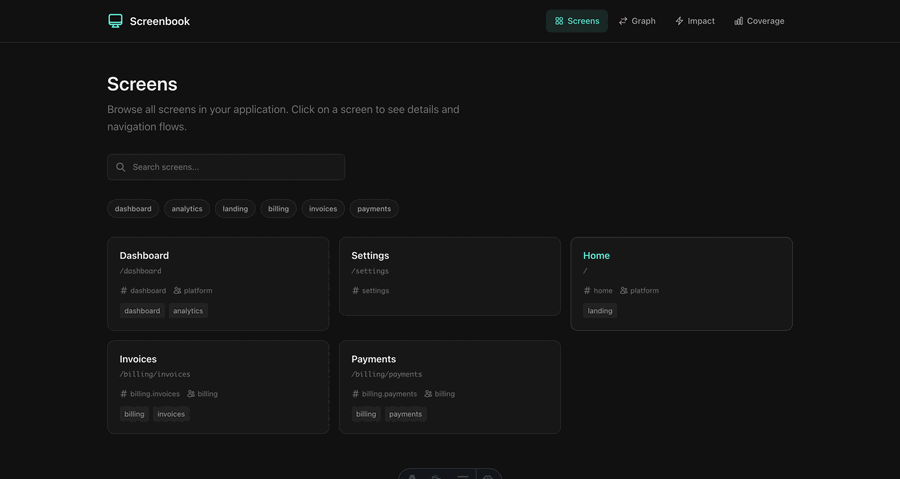

<p align="center">
  
</p>

<h1 align="center">Screenbook</h1>

<p align="center">
  <strong>When you change an API, do you know which screens will break?</strong>
</p>

<p align="center">
  
</p>

## The Problem

Managing screen documentation in frontend applications is hard:

- **Manual docs get stale** - That Notion page hasn't been updated in months
- **Spreadsheets don't track changes** - No one knows when the API contract changed
- **You find out in production** - "Wait, that screen uses this API too?"

## The Solution

Screenbook creates a **living map** of your screens and their API dependencies. Define screens in code, and get automatic:

1. **Impact Analysis** - "If I change UserAPI, which screens break?"
2. **CI Lint** - Fail builds when screen documentation is missing
3. **Navigation Graph** - Visualize how users flow through your app
4. **Coverage Dashboard** - Track documentation health across teams

## Quick Start

```bash
# Install
pnpm add -D @screenbook/core @screenbook/cli

# Initialize
npx screenbook init

# Generate metadata from existing routes
npx screenbook generate

# Start the UI
npx screenbook dev
```

Open http://localhost:4321 to see your screen catalog.

## Define Screens in Code

Create `screen.meta.ts` alongside your route files:

```ts
// src/pages/billing/invoices/screen.meta.ts
import { defineScreen } from "@screenbook/core"

export const screen = defineScreen({
  id: "billing.invoices",
  title: "Invoice List",
  route: "/billing/invoices",
  owner: ["billing-team"],
  tags: ["billing", "invoices"],
  dependsOn: ["InvoiceAPI.list", "UserAPI.getCurrent"],
  next: ["billing.invoice.detail", "billing.payments"],
})
```

## Impact Analysis

The killer feature. When you're changing an API, see every affected screen:

```bash
npx screenbook impact InvoiceAPI.list
```

Or use the UI at `/impact` to visualize the impact graph.

## CI Integration

Prevent documentation drift by failing CI when screens are undocumented:

```bash
npx screenbook lint
```

### PR Impact Comments

Automatically analyze API changes in PRs and post impact reports:

```bash
npx screenbook pr-impact --base main
```

Output example:
```markdown
## Screenbook Impact Analysis

**3 screens affected** by changes to 1 API

### InvoiceAPI

**Direct dependencies** (2):
| Screen | Route | Owner |
|--------|-------|-------|
| billing.invoices | `/billing/invoices` | billing-team |
| billing.invoice.detail | `/billing/invoices/:id` | billing-team |

**Transitive dependencies** (1):
- dashboard → billing.invoices
```

### GitHub Action

Add automatic impact analysis to your PRs:

```yaml
# .github/workflows/screenbook-impact.yml
name: Screenbook Impact Analysis

on:
  pull_request:
    types: [opened, synchronize]

permissions:
  contents: read
  pull-requests: write

jobs:
  impact-analysis:
    runs-on: ubuntu-latest
    steps:
      - uses: actions/checkout@v4
        with:
          fetch-depth: 0

      - uses: actions/setup-node@v4
        with:
          node-version: '20'

      - uses: pnpm/action-setup@v4
        with:
          version: 9

      - run: pnpm install
      - run: pnpm screenbook build

      - name: Analyze and comment
        run: |
          pnpm screenbook pr-impact --base ${{ github.event.pull_request.base.ref }} > impact.md
          gh pr comment ${{ github.event.number }} --body-file impact.md
        env:
          GH_TOKEN: ${{ github.token }}
```

### Progressive Adoption

For large projects, adopt Screenbook gradually:

```ts
// screenbook.config.ts
export default defineConfig({
  metaPattern: "src/pages/**/screen.meta.ts",
  routesPattern: "src/pages/**/page.tsx",

  adoption: {
    mode: "progressive",
    includePatterns: ["src/pages/billing/**"], // Start with billing
    minimumCoverage: 80, // Fail below 80%
  },
})
```

## CLI Commands

| Command | Description |
|---------|-------------|
| `screenbook init` | Initialize Screenbook |
| `screenbook generate` | Auto-generate screen.meta.ts from routes |
| `screenbook build` | Build metadata JSON |
| `screenbook dev` | Start the UI server |
| `screenbook lint` | Check coverage (CI integration) |
| `screenbook impact <api>` | Analyze API change impact |
| `screenbook pr-impact` | Analyze PR changes impact |

## Configuration

```ts
// screenbook.config.ts
import { defineConfig } from "@screenbook/core"

export default defineConfig({
  // Where to find screen.meta.ts files
  metaPattern: "src/**/screen.meta.ts",

  // Where to find route files (for generate/lint)
  routesPattern: "src/pages/**/page.tsx",

  // Output directory
  outDir: ".screenbook",

  // Progressive adoption (optional)
  adoption: {
    mode: "progressive",
    includePatterns: ["src/pages/billing/**"],
    minimumCoverage: 80,
  },
})
```

## License

MIT
