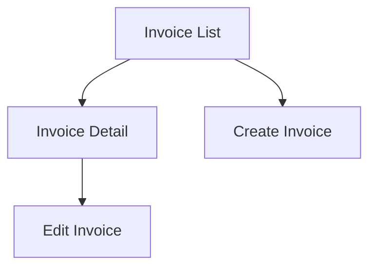

Screenbook generates a navigation graph from your screen definitions, showing how users can move between screens.

## How It Works

The navigation graph is built from two fields in your screen definitions:

- **`next`**: Screens this page links to
- **`entryPoints`**: Screens that link to this page

```ts
// billing/invoice/list/screen.meta.ts
export const screen = defineScreen({
  id: "billing.invoice.list",
  title: "Invoice List",
  route: "/billing/invoices",
  next: ["billing.invoice.detail", "billing.invoice.create"],
})

// billing/invoice/detail/screen.meta.ts
export const screen = defineScreen({
  id: "billing.invoice.detail",
  title: "Invoice Detail",
  route: "/billing/invoices/:id",
  entryPoints: ["billing.invoice.list"],
  next: ["billing.invoice.edit"],
})
```

## Generated Output

Running `screenbook build` generates a Mermaid flowchart:

```bash
npx screenbook build
```

This creates `.screenbook/graph.mmd`:



## Viewing the Graph

### In Screenbook UI

Start the development server and navigate to the Graph view:

```bash
npx screenbook dev
```

The UI renders the Mermaid diagram interactively.

### In Documentation

Embed the graph in your docs using Mermaid-compatible tools.

### In VS Code

Install the [Mermaid Preview extension](https://marketplace.visualstudio.com/items?itemName=bierner.markdown-mermaid) to view `.mmd` files.

## Understanding the Graph

### Node Colors

In the Screenbook UI, nodes are color-coded:

- **Default**: Regular screens
- **Highlighted**: Currently selected screen
- **Warning**: Orphan screens (no entry points)

### Edge Types

Edges represent navigation possibilities:

- **Solid lines**: Direct navigation (via `next`)
- **Implicit edges**: Derived from `entryPoints`

## Orphan Detection

Screens without `entryPoints` that aren't referenced by any `next` are marked as orphans:

```bash
npx screenbook lint
```

```
⚠ Orphan screens detected:
  - admin.settings (not reachable from any screen)
```

This helps identify:
- Unreachable pages
- Missing navigation links
- Documentation gaps

## Best Practices

### 1. Define Both Directions

For accurate graphs, define relationships from both sides:

```ts
// list/screen.meta.ts
next: ["detail"]

// detail/screen.meta.ts
entryPoints: ["list"]
```

### 2. Group Related Screens

Use hierarchical IDs to group related screens:

```
billing.invoice.list
billing.invoice.detail
billing.invoice.edit
billing.payment.start
billing.payment.confirm
```

### 3. Track Modal/Dialog Flows

Include modals and dialogs as separate screens if they have distinct URLs:

```ts
// billing/invoice/detail/screen.meta.ts
next: [
  "billing.invoice.edit",
  "billing.invoice.delete-modal",  // Modal dialog
]
```

### 4. Document External Links

For external navigation (leaving your app), use `links` instead:

```ts
links: [
  { label: "Support Portal", url: "https://support.example.com" },
]
```
